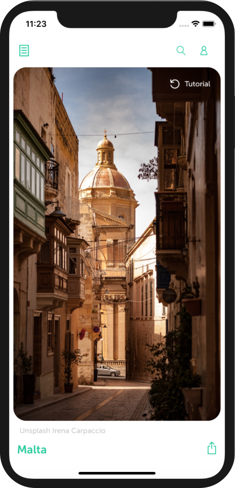

# Orbzii Travel App

```
React Native
Typescript 
Redux
```



<br/><br/><br/><br/><br/><br/><br/>
Travel app for iOS that enables a user to swipe through images tinder style. Based on the likes and dislikes the app can suggest holidays the user might enjoy. 

They can search for hotels and/or flights and build a holiday package that suits them, and check out in the app. 


<p align="center">
  
</p>